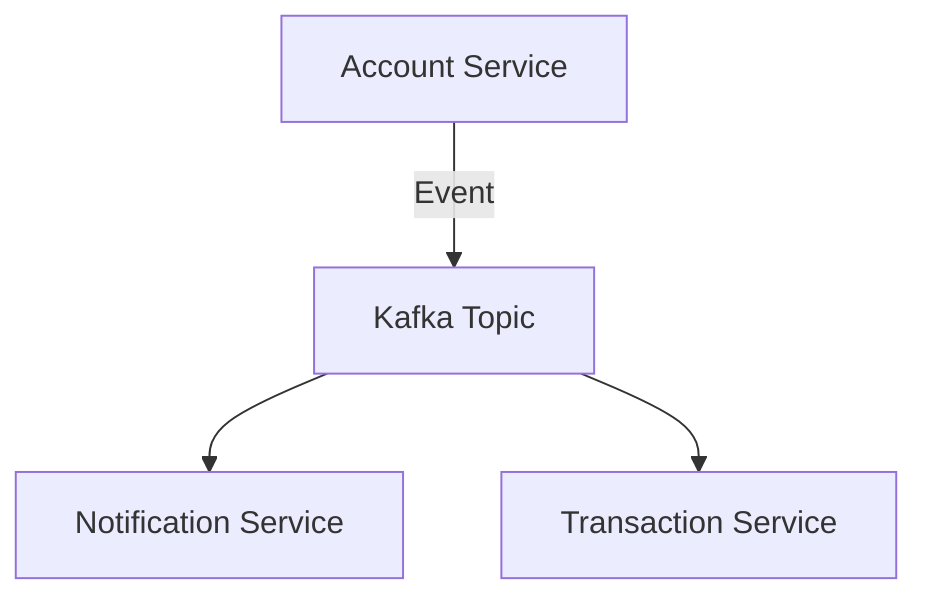

# 🧭 Path to Architect — From Java Developer to Solution Architect

If you're a **Java + React full-stack dev** dreaming to move up into architecture — this guide gives you a **12-month hands-on roadmap**.  
No fluff. Only real code, systems, and deliverables. 🚀

---

## ⚙️ Overview

| Phase | Focus | Key Outcomes |
|-------|--------|--------------|
| 1–2 | Backend Mastery | Spring Boot microservices + OpenAPI |
| 3 | BFF Layer | API Gateway + React integration |
| 4 | Event Driven | Kafka + Saga + Outbox |
| 5 | System Design | Diagrams + ADR + C4 Models |
| 6–7 | Cloud Infra | AWS + Terraform + CI/CD |
| 8 | Frontend Architecture | React Microfrontends |
| 9 | Observability | Logging + Metrics + Tracing |
| 10 | Scalability | Performance + Caching |
| 11 | Leadership | Design Reviews + Mentorship |
| 12 | Portfolio | Publish Projects + Certify |

---

## 🧱 Phase 1–2: Backend Deep Dive (Java Spring Boot)

Build modular microservices:

```bash
modules/
 ├── account-service
 ├── transaction-service
 ├── notification-service
 └── api-gateway
```

**Tech:**  
Spring Boot 3, Spring Cloud, Feign Client, Resilience4j, PostgreSQL, Redis, Docker

✅ Deliverables  
- Clean architecture (package-by-feature)  
- OpenAPI spec + Redocly doc bundle  
- JWT auth, circuit breaker  
- Unit + integration tests  

---

## 💙 Phase 3: API Gateway + BFF Layer

Create a **Node.js + GraphQL** BFF that aggregates all backend APIs.

```bash
routes/
 ├── /account
 ├── /transaction
 ├── /notification
```

**Deliverables:** unified schema, caching, rate limit, healthcheck.  
Frontend: React + Tailwind + Redux Toolkit.

---

## 💜 Phase 4: Event-Driven Architecture

Integrate Kafka for inter-service communication.



✅ Saga orchestration + Outbox pattern + retries.

---

## 💛 Phase 5: System Design & Documentation

Write real architecture artifacts.

```
docs/
 ├── HLD.md
 ├── LLD.md
 ├── ADR/
 └── diagrams/
```

**Tools:** Mermaid, PlantUML, C4 model.  
Document decisions, tradeoffs, and scaling assumptions.

---

## ☁️ Phase 6–7: Cloud & Infra

**Deploy the system to AWS:**

- ECS / EKS for services  
- RDS for DB  
- Terraform for IaC  
- GitHub Actions for CI/CD  

**Goal:** end-to-end automation — push → build → deploy → observe.

---

## 💚 Phase 8: Frontend System Design

Move to **React Microfrontend architecture**.

- Module Federation  
- Shared auth & design system  
- Storybook documentation  

---

## ❤️ Phase 9: Observability + Security

- Prometheus + Grafana  
- ELK stack  
- Keycloak for OIDC  
- Alerts + metrics dashboard  

---

## 🩶 Phase 10: Performance + Scalability

- Load testing with k6 or JMeter  
- DB optimization (indexes, caching)  
- CDN integration  

---

## 🤍 Phase 11: Leadership & Design Influence

- Mentor devs on clean architecture  
- Review design docs  
- Plan migration (monolith → microservices)  

---

## 💎 Phase 12: Final Portfolio

Structure your GitHub repo like:

```bash
architect-portfolio/
 ├── microservices-blueprint/
 ├── react-bff/
 ├── event-driven-payments/
 ├── infra-terraform/
 └── docs/
```

**Certifications (optional):**
- AWS Solutions Architect Associate  
- Google Cloud Architect  
- O’Reilly Software Architecture Fundamentals  

---

## 📘 Recommended Books

- *Clean Architecture* — Robert C. Martin  
- *Building Microservices* — Sam Newman  
- *Software Architecture: The Hard Parts* — Neal Ford  

---

## 🧩 Final Thoughts

Becoming an **architect** isn’t about titles — it’s about *seeing systems end to end*, designing for change, and mentoring others to do the same.

Keep shipping systems, not slides. 💪  
— *Prem*
